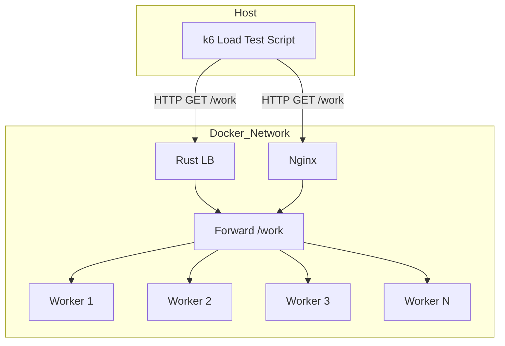

# Proxy based load balancer

## Workers

Each worker runs in its own container.

The /work endpoint simulates computation (can add artificial delay via `duration_millis` query parameter).

## Load Balancer

Forwards incoming requests to available workers.
The list of worker servers is defined in `resources/config.yml`, which is mounted into the load balancer container.

## Load Test Setup



Executed from the host machine:

```
docker compose build
docker compose up

# for custom Rust LB
BASE_URL=http://localhost:3000 k6 run load_tests/latency_percentiles.js

# for nginx
BASE_URL=http://localhost:4000 k6 run load_tests/latency_percentiles.js
```

Collects latency percentiles (p50, p90, p99, p99.9), throughput, and error rates.

The percentiles obtained can be fed into `load_tests/plot.py` to create a comparison graph.